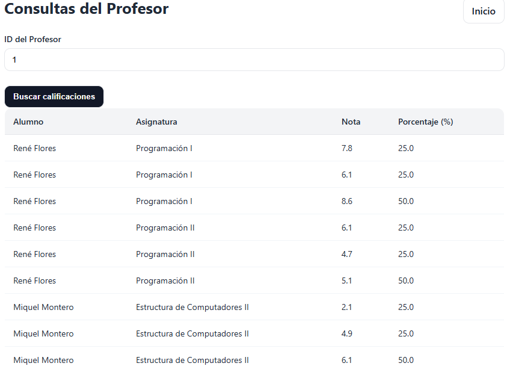
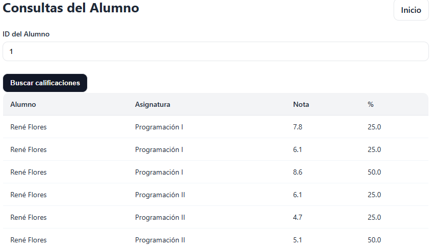

# Gestor de Colegio

## Descripción del proyecto

El proyecto consiste en realizar una WebApp que permita realizar ciertas consultas de un colegio. Principálmente serán
los alumnos y profesores quienes podrán realizar ciertas consultas. 

El proyecto ha sido desarrollado en Java (usando SpringBoot) y tiene incluido varios tests para las 3 capas implementadas.

## Análisis

### Análisis de Requisitos

#### Profesor

· Un profesor podrá consultar de cada asignatura que esté a cargo, las calificaciones de sus estudiantes.

#### Alumno

· Un alumno podrá obtener todas las calificaciones de sus asignaturas.

### Análisis Técnico

#### UML

### Arquitectura

Se ha utilizado la arquitectura de 3 capas.

- **Business**: Contiene los servicios de las diferentes clases y gestiona las peticiones que mandan los controladores 
correspondientes.
- **Data**:
- **Presentation**: 