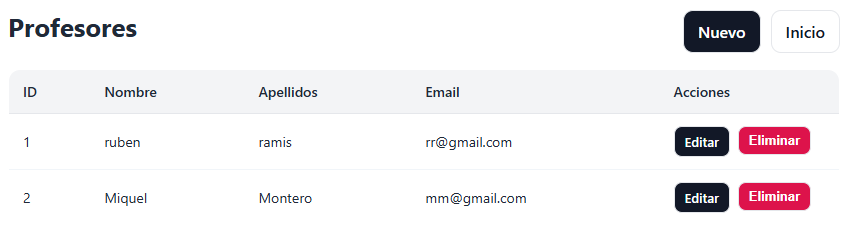

# Gestor de Colegio

## Descripción del proyecto

El proyecto consiste en realizar una WebApp que permita realizar ciertas consultas de un colegio. Principálmente serán
los alumnos y profesores quienes podrán realizar ciertas consultas. 

El proyecto ha sido desarrollado en Java (usando SpringBoot) y tiene incluido varios tests para las 3 capas implementadas.

## Análisis

### Análisis de Requisitos

#### Profesor

· Un profesor podrá consultar de cada asignatura que esté a cargo, las calificaciones de sus estudiantes.

#### Alumno

· Un alumno podrá obtener todas las calificaciones de sus asignaturas.

### Análisis Técnico

#### UML

  

### Arquitectura

Se ha utilizado la arquitectura de 3 capas.

- **Business**: Contiene los servicios de las diferentes clases y gestiona las peticiones que mandan los controladores 
correspondientes.
- **Data**:
- **Presentation**: 

### Guía de Usuario

Una vez se arranca el programa, el usuario deberá introducir en su navegador http://localhost:8080/ para poder
ver la página principal, donde se mostrará el siguiente panel.

  

En las 4 primeras secciones, tendrá la opción de visualizar la información que haya almacenada de cada clase. Es 
importante seguir el siguiente orden a la hora de añadir información para poder interactuar correctamente con el 
programa debido a las relaciones.

1. Añadir profesores.
2. Añadir alumnos.
3. Añadir asignaturas.
4. Añadir calificaciones.

Una vez se haya añadido la información correspondiente, dentro de cada sección dispondrá de las acciones *Editar* y *Eliminar*.

  

Cuando ya se haya añadido información a cada una de las 4 primeras secciones, ya se podrá realizar sin problema las 
consultas de los 2 últimos apartados. Para las consultas de los profesores, saldrá según el id del profesor que se 
introduzca lo siguiente:

  

Mientras que para los alumnos, podrán consultar la siguiente información sobre sus calificaciones:

  

## Tecnologías Utilizadas

| Tecnología      |                    Información                    |
|-----------------|:--------------------------------------------------|
| Java            |                    Versión 21                     |
| Intellij IDEA   |               Entorno de desarrollo               |
| Spring Boot     |                   Versión 3.5.6                   |
| Lombok          | Uso de anotaciones para generar código más limpio |
| H2              |                   Base de datos                   |
| JUnit & Mockito |             Realización de los tests              |
| Github          |   Repositorio del código y gestión de versiones   |
| Thymeleaf       |           Para la creación de la vista            |
| Drawio          |                 Creación del UML                  |